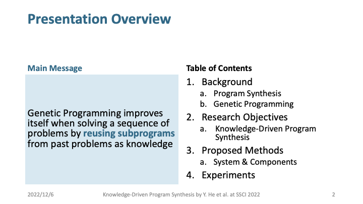
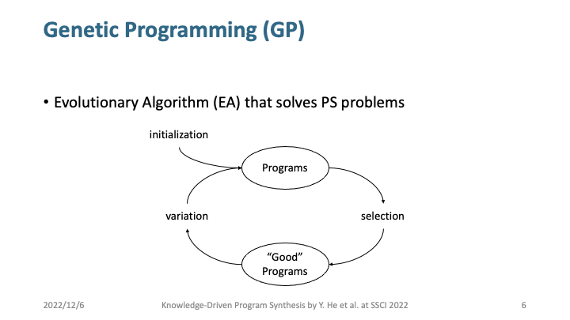
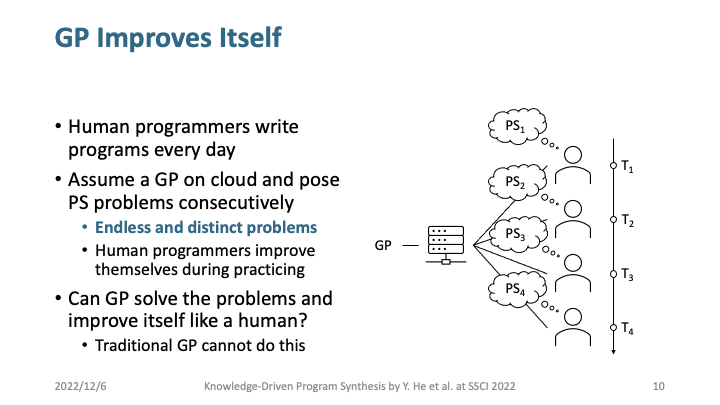
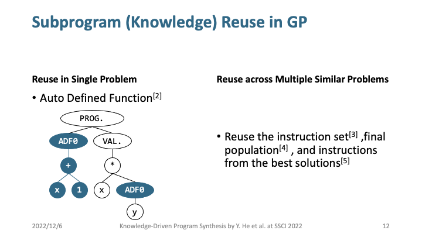
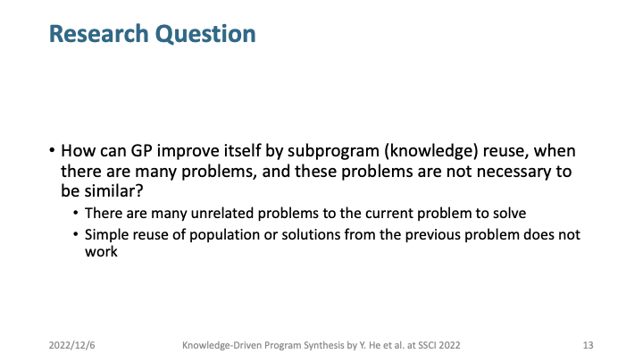
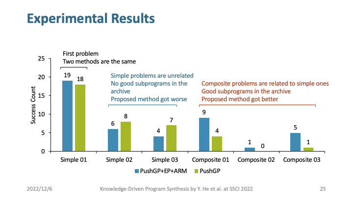
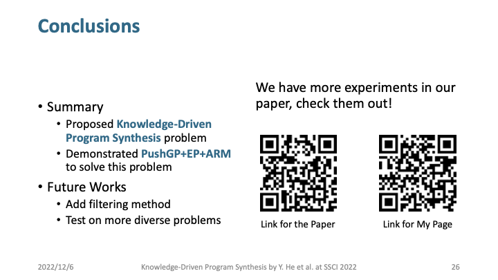
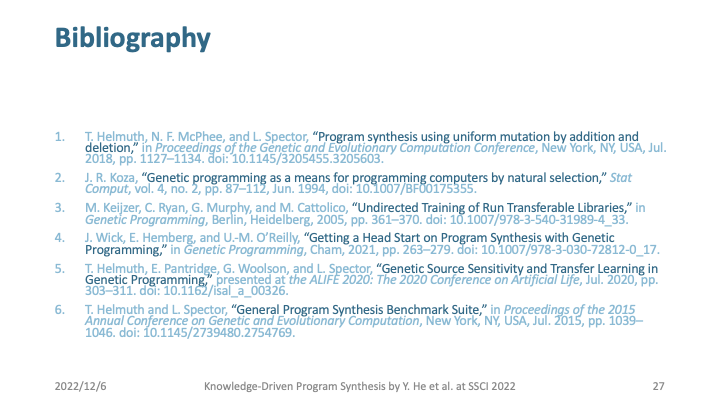

# 知识驱动的程序合成

## 背景

*Program Synthesis* (PS) aims to automatically compose computer programs to satisfy several specifications. In the Evolutionary Computation (EC) literature, the frequently specification is I/O examples.

EC is a group of optimization methods. Therefore, PS problems are naturally modeled as optimization problem in this field. **PS aims to find a sequence of instructions from an available set to minimize the difference between actual output and expected output.**

Below I show you an example of the PS problem.

- Instruction set: `in0`, `in1`, `add`, `sub`, `mult`, `div`

- I/O examples
  - input=(0,0); output=0
  - input=(1,0); output=1
  - input=(0,2); output=4
  - ......

- Program: `mult(sub(in0,in1), sub(in0,in1))`

*Genetic Programming* (GP) is a group of Evolutionary Algorithms that compose computer programs. It has typical steps such as initialization, selection, crossover, and mutation. GP has been used in many applications, such as evolving neural networks, extracting image features, extracting trading rules, designing robotics, and designing circuits.

## 研究目的

In this research, we focus on **a GP algorithm that improves itself**.

Human programmers write programs every day. If we run a GP algorithm on the cloud and pose PS problem to this GP consecutively, this GP algorithm will face to endless and distinct problems, just like a human. An interesting thing is that we human improve ourselves by practicing on these problems. Very naturally, we want to ask if GP can solve problems and improve itself like a human? Unfortunately, the traditional GP cannot do this. You run GP several repetitions to solve the same problem, the performance does not get better.

When we look at how a human improves himself/herself, several terms come into our mind: "learning", "knowledge", and "experience". There definitely are connections between these concepts. One of the connections is, **knowledge is what we learned from our experience**. Specifically for computer programming, one thing we always do is to reuse the code fragments (subprograms) that are written in the past. For instance, let's look at the following two pieces of the code.

```python
'''genetic algorithm
'''
for i in range(N): # initialization
    x = np.random.uniform(xl, xu, nvar)
    X.append(x)
```

```python
'''artificial bee colony
'''
if n >= n_limit: # scout bee
    x = np.random.uniform(xl, xu, nvar)
    X.append(x)
```

The first one is the initialization step of genetic algorithm in python while the second one is the scout bee operator of artificial bee colony in the same language. The important thing here is that the last two lines of these codes are the same. Therefore, if we have already programmed the genetic algorithm, we can simply copy and paste the code to write the artificial bee colony.

Therefore, in computer programming, the subprogram is a type of knowledge, and what we do with this knowledge is to store it and reuse it properly.

In this study, we want to do the similar thing (subprogram reuse) for the GP algorithm. In fact, there are some studies working on subprogram reuse.

1. Reuse in the single problem

   This part of the literature includes modularity methods such as Automatically Defined Functions.

2. Reuse accross several similar problems

   Some studies proposed to reuse instruction set, final populations, and instructions from the best solution.

We here go straight forward to propose our research question: **how can a GP improve itself by subprogram (knowledge) reuse, when there are many problems, and these problems are not necessary to be similar?**

We call this problem *Knowledge-Driven Program Synthesis* (KDPS) problem. In a KDPS problem, GP is required to solve a sequence of PS problems. When solving a problem, GP uses the subprograms from the past problems.

It is notable that we are not assuming that the sequence is small or the problems in the sequence are similar. Therefore, simple methods like reusing final populations (using final population of a GP run a the initial population of another run) might not work well.

Currently, we divide this problem into three parts. We have some initial results on the last two parts in a paper at SSCI 2022.

1. Given a program, how can we extract subprograms?

2. Given a subprogram, how can we reuse it?

3. Given a set of subprograms, how can we select proper ones to use?

For more details, you can check the prsentation below.

## SSCI 2022 学术报告

Please check the following presentation for more details. This presentation is done at IEEE SSCI 2022 conference.





















