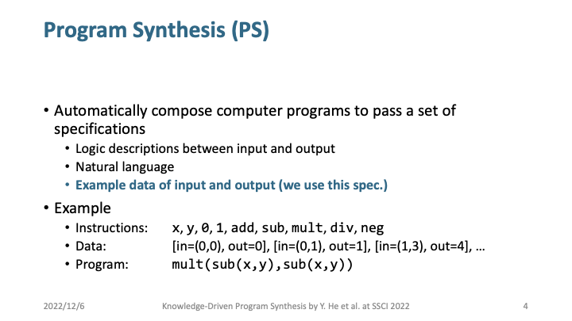
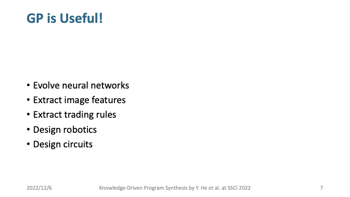
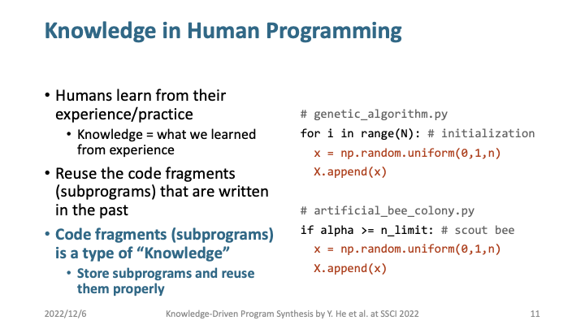
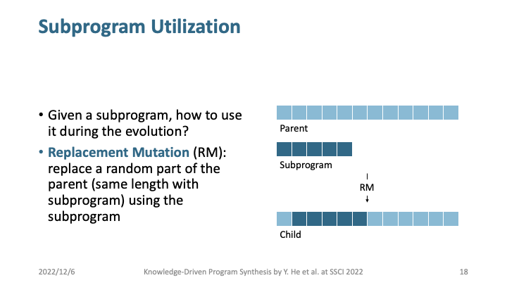
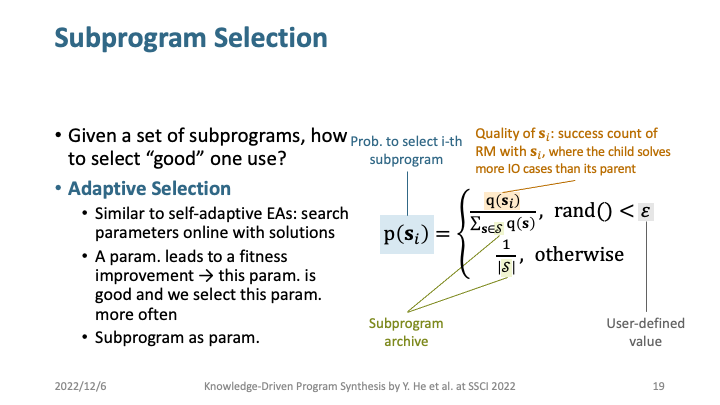
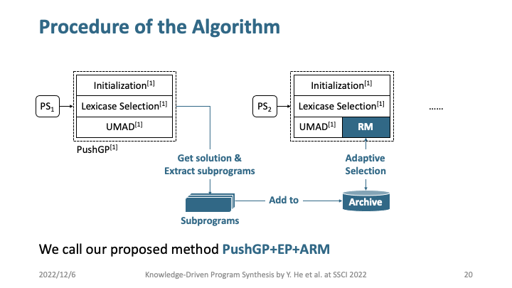
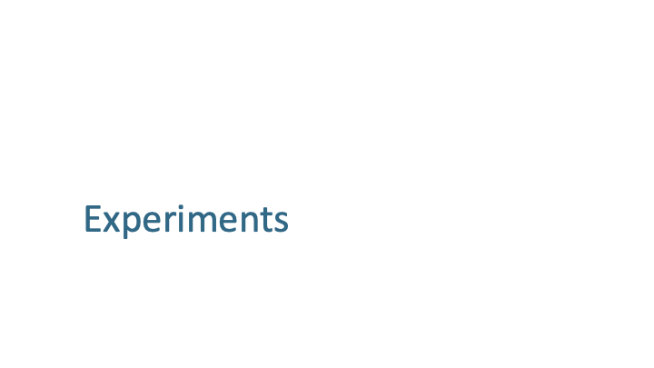
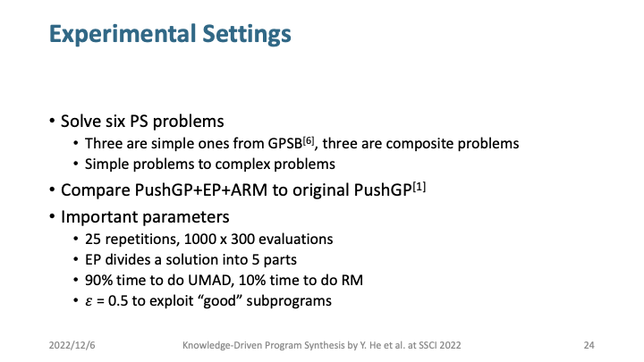

# Knowledge-Driven Program Synthesis

Program Synthesis (PS) requires an intelligent agent to compose computer programs with minimal human efforts. My studies focus on a group of search algorithms called Genetic Programming (GP). GP uses the idea of natural evolution. It starts with a random population of programs, selects the better subsets and updates them until the target program is found.

However, the conventional GPs cannot obtain knowledge from the problem that it has solved. I believe that enhancing GPs with the ability to learn from its experiences can help GPs to generate more complex computer programs.

Therefore, I focus on **how can a GP solves problems, extracts knowledge, and uses the knowledge in later problems**. I call this problem the Knowledge-Driven Program Synthesis (KDPS) problem.

The figure below shows an intuition of the KDPS problem. At the beginning, "Problem 1" is posed to the "Solver" and the "Solver" returns the target solution "Program 1". This "Program 1" is then used to extract "Knowledge Archive 1" with an "Extractor". After that, the "Solver" will use "Kwowledge Archive 1" to solve the "Problem 2".

To study the KDPS problem, there are several sub-problems to start with.

- What could be used as "knowledge"?
- How can we extract knowledge from a program?
- How can we use the extracted knowledge to solve a new problem?
- How can we manage the knowledge archive with an increasing size?

Please also check the following presentation for more details. This presentation is done at IEEE SSCI 2022 conference.

