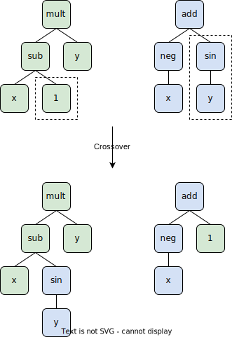

# Genetic Programming

[*>> 用中文查看此页面*](/cn/tutorials/gp/)

In this short article, we will look at Genetic Programming, a group of Evolutionary Algorithms that generates computer programs.

- [Introduction](#introduction)
- [Procedure of GP](#procedure-of-gp)
- [Resources](#resources)

---

## Introduction

*Genetic Programming* (GP) is a group of Evolutionary Algorithms (EAs) that compose computer programs. GP takes a set of $m$ example I/O pairs as the program specification and searches the program that satisfies the given examples. This task to compose computer programs automatically is called *Program Synthesis* (PS).

Usually, we need to provide a set of instructions (primitives) $\mathcal{I}$ and GP performs metaheuristic search to compose a sequence of these instructions $\mathbf{p}$ (program) so that the output of the composed program is the same as the output given in the example.

$$
\begin{aligned}
minimize &\quad \Sigma_{k=1}^m||\mathbf{p}(\mathrm{in}_k)-\mathrm{out}_k|| \\
s.t.     &\quad \mathbf{p}=(p_1,\dots,p_i,\dots,p_n) \\
         &\quad p_i\in\mathcal{I} \\
         &\quad n\leq n_{max}
\end{aligned}
$$

For instance, we have the following instructions and I/O examples.

- Instructions

  `x`, `y`, `add`, `sub`, `mult`, `div`

- I/O examples

  | Input | Output |
  | ----- | ------ |
  | 1, 2  | 1      |
  | 1, 1  | 0      |
  | 5, -1 | 36     |

One of the solution program could be `mult(sub(x,y),sub(x,y))`. This program is equivalent to ${(x-y)}^2$.

This example seems to be very simple, but GP could do many amazing applications as well. Below I list some applications of GP. All of them are special cases of the general PS problem.

- Evolving neural networks
- Designing soft robotics
- Designing circuits
- Extracting stock trading rules
- Extracting image features

## Procedure of GP

The initial version of GP[^1] contains typical steps of an EA, namely initialization, selection, crossover, and mutation. Notably, the initial version of GP uses a tree to encode a computer program into a genome. GP additionally employs a bloat control technique to prevent the infinity size of the tree.

### Encoding

A computer program can be expressed with a tree. In a tree, every node takes its child nodes as arguments. The leaf nodes are terminals that takes no arguments, such as inputs `x` and `y`. The root node returns the computational result of the program. The following figure shows a tree of the program `mult(sub(x,y),sub(x,y))`.

Generally, GP starts with a random population of this type of trees (programs). GP selects better trees in the population and updates them to get new trees consecutively.

### Initialization

During the initialization step, a number of $N$ trees are randomly generated with a specified interval of tree depth. One way to generate a random tree is to start with a random root node and recursively add child nodes using random primitives until all nodes have enough child nodes.

### Selection

The selection step of GP is the same as that of Genetic Algorithm (GA). We can use Tournament Selection (TS) for example. TS selects a random subset (with size of $t$) of the population and takes the best individual of this subset as the selected parent.

### Crossover

The crossover of GP is designed specifically for tree data structure. During crossover, two parent trees are going to exchange their subtrees to generate two child trees. These subtrees are randomly selected.

### Mutation

Similar to crossover, the mutation of GP is also designed for tree data structure. The mutation step replaces a randomly selected subtree of the parent tree with a randomly generated tree.

### Bloat Control

Obviously, the tree size is not fixed during evolution. For example, if the mutation operator replaces a leaf node with a tree (depth is 3), the size of the child tree will become larger. Without any limitation, the tree size can increase continuosly during evolution. This issue is called bloat.

Bloat can causes at least three problems.

1. A large tree takes more time to evaluate.
2. A large tree indicates a large search space.
3. The modifications on the deep nodes in a large tree is hard to propagate to the root.

To control this bloat issue, a simple way is to abandon the child tree and revert to its parent if the child tree is over a preset depth.

## Resources

Here are some resources to implement a simple GP algorithm.

- [An Python example of Symbolic Regression by GP using DEAP library](https://github.com/DEAP/deap/blob/master/examples/gp/symbreg.py)
- [Another Python library for GP - gplearn](https://github.com/trevorstephens/gplearn)

[^1]: Koza, John R. "Genetic programming as a means for programming computers by natural selection." *Statistics and computing* 4.2 (1994): 87-112.
